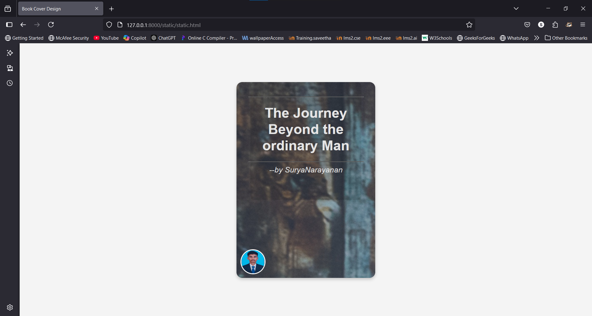

# Ex.06 Book Front Cover Page Design
## Date:08/12/2024

## AIM:
To design a book front cover page using HTML and CSS.

## DESIGN STEPS:

### Step 1:
Create a Django Admin project.

### Step 2:
Create an app in the Django interface.

### Step 3:
Create a folder named 'static' in the app folder.

### Step 4:
Create a new HTML file in the static folder.

### Step 5:
Write the HTML code with relevant CSS properties.

### Step 6:
Choose the appropriate style and color scheme.

### Step 7:
Insert the images in their appropriate places.

### Step 8:
Publish the website in the LocalHost.

## PROGRAM:
```
<!DOCTYPE html>
<html lang="en">
<head>
    <meta charset="UTF-8">
    <meta name="viewport" content="width=device-width, initial-scale=1.0">
    <title>Book Cover Design</title>
    <style>
        body {
            margin: 0;
            padding: 0;
            display: flex;
            justify-content: center;
            align-items: center;
            height: 100vh;
            background-color: #f4f4f4;
        }
        .book-cover {
            
            width: 300px;
            height: 450px;
            background: linear-gradient(to bottom, #ff7f50, #ff6347);
            color: white;
            text-align: center;
            border-radius: 15px;
            box-shadow: 0 4px 8px rgba(0, 0, 0, 0.2);
            padding: 30px;
            position: relative;
            font-family: 'Arial', sans-serif;
            background-image: url("christmas-8453176.jpg");
        }
        .book-title {
            font-size: 36px;
            font-weight: bold;
            margin: 20px 0;
        }
        .author-name {
            font-size: 20px;
            font-style: italic;
            margin-bottom: 30px; /* Added extra space */
        }
        .author-photo {
            width: 60px;
            height: 60px;
            border-radius: 50%;
            position: absolute;
            bottom: 10px;
            left: 10px;
            border: 3px solid white;
        }
        .book-cover::before {
            content: '';
            position: absolute;
            top: 0;
            left: 50%;
            width: 80%;
            height: 60%;
            background-color: rgba(0, 0, 0, 0.1);
            transform: translateX(-50%);
            border-radius: 10px;
        }
    </style>
</head>
<body>
    <div class="book-cover">
        <hr>
        <div class="book-title">
            The Journey Beyond the ordinary Man
        </div>
        <hr>
        <div class="author-name">
            --by SuryaNarayanan
        </div>
        
    </div>
</body>
</html>


```

## OUTPUT:


## RESULT:
The program for designing book front cover page using HTML and CSS is completed successfully.
